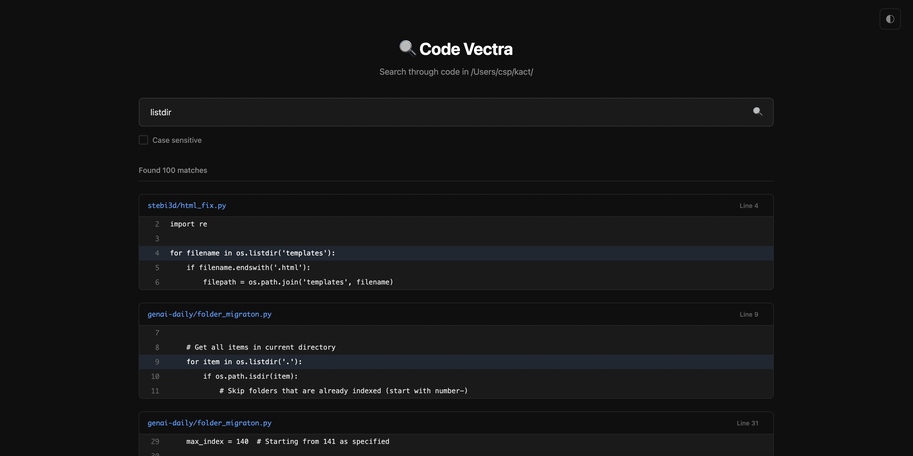
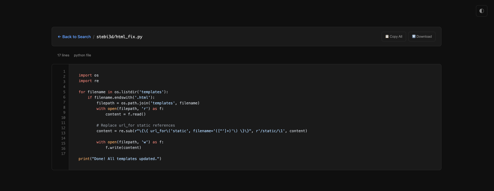

# Code Vectra - Local Code Search Engine

A fast, web-based code search engine similar to grep.app that searches through your local codebase.

## Features

- 🔍 **Fast regex-based search** across all code files
- 🎨 **Clean, modern UI** with dark/light theme support
- 📁 **Smart file filtering** - automatically detects and searches text files
- 🔤 **Case-sensitive search** option
- 📱 **Responsive design** works on desktop and mobile
- ⚡ **Real-time search** with context highlighting
- 📋 **Click to copy** code lines
- 📄 **File viewer** - click on file paths to view complete file content
- 🎨 **Syntax highlighting** for popular programming languages
- ⬇️ **Download files** directly from the viewer

## Setup

1. Install dependencies:
```bash
pip install -r requirements.txt
```

2. Copy the environment configuration:
```bash
cp .env.sample .env
```

3. Edit `.env` file to configure your search directory:
```bash
# Directory to search for code files
SEARCH_ROOT=/path/to/your/code/directory

# Maximum file size to search (in bytes)
MAX_FILE_SIZE=1048576

# Server configuration
HOST=0.0.0.0
PORT=8001
```

4. Run the application:
```bash
python app.py
```

5. Open your browser to `http://localhost:8001`

## Usage

- Enter search patterns using regex syntax
- Use the case-sensitive checkbox for exact matches
- **Filter by file type**: Add `*.py *.js *.ts` to search only specific file extensions
- Click on any code line to copy it to clipboard
- Use `Ctrl/Cmd + K` to quickly focus the search input
- **Click on file paths** in search results to view the complete file
- In file viewer:
  - Click line numbers to copy individual lines
  - Use "Copy All" to copy the entire file
  - Use "Download" to save the file locally
  - Press `Escape` to go back to search results

### Search Examples

**Using + separator:**
- `gpt-3.5-turbo + *.py` - Search for "gpt-3.5-turbo" only in Python files
- `function + *.js *.ts` - Search for "function" in JavaScript and TypeScript files
- `import React + *.jsx *.tsx` - Search for "import React" in React component files

**Using space separator (legacy):**
- `function *.py` - Search for "function" only in Python files
- `class.*Component *.py *.js` - Search for class definitions containing "Component" in Python and JavaScript files

## Supported File Types

The search engine automatically detects and searches common code file types including:
- Python (.py)
- JavaScript/TypeScript (.js, .ts, .jsx, .tsx)
- HTML/CSS (.html, .css, .scss)
- Java (.java)
- C/C++ (.c, .cpp, .h, .hpp)
- And many more...

## Configuration

You can customize the search behavior by modifying the `.env` file:

- `SEARCH_ROOT`: Directory to search in
- `MAX_FILE_SIZE`: Maximum file size to search (default: 1MB)
- `HOST`: Server host (default: 0.0.0.0)
- `PORT`: Server port (default: 8001)

The supported file extensions are defined in `app.py` and include most common programming languages.


### Screenshots



